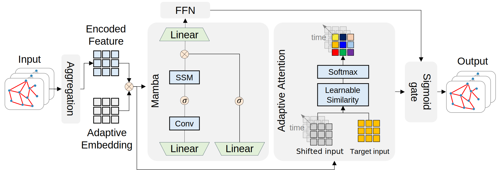

This repository contains the implementation of **Tramba**, a Mamba-based model with adaptive attention designed for urban traffic speed prediction. It jointly models long-range temporal dependencies and non-local spatial correlations to capture complex traffic dynamics in dense urban networks.


---

##  Model Architecture

The Tramba model integrates:

- **Adaptive attention** to capture non-local spatial correlations across road links,
- **Mamba** to capture temporal dependencies,
- **Gated fusion** of spatial and temporal features.

<p align="center">
  
</p>

---

## Project Structure

```

├── data/
│   └── seoul_traffic_speed (sample).csv  # Sample 5-minute speed data for Gangnam links
│   └── GN_links.csv             # Metadata for Gangnam road link IDs
├── results/                     # Saved results will be stored here
├── data_loader.py              # Data preprocessing and sequence construction
├── models.py                   # Tramba model definition
├── run_tramba.ipynb            # Training and evaluation notebook

````

## ️ Data Description

- The dataset includes 5-minute interval speed records (in km/h) for road links in the **Gangnam-gu** area of **Seoul**, South Korea.
- It is publicly available via [TOPIS](https://topis.seoul.go.kr/) upon request.
- This repository includes a sample dataset.
- **Disclaimer**: The author does not have the right to redistribute the full dataset.

###  `seoul_traffic_speed.csv`

This file contains traffic speed time-series with the following columns:

| Column     | Description                                |
|------------|--------------------------------------------|
| PRCS_YEAR  | Year of observation                        |
| PRCS_MON   | Month of observation                       |
| PRCS_DAY   | Day of observation                         |
| PRCS_HH    | Hour of observation                        |
| PRCS_MIN   | Minute of observation                      |
| LINK_ID    | Unique identifier of a road link (integer) |
| PRCS_SPD   | Average speed in km/h                      |

A `datetime` index is constructed from the time columns for temporal sorting and sequence construction.

###  `GN_links.csv`

This file filters the set of links used for training. It contains:

| Column   | Description                                                     |
|----------|-----------------------------------------------------------------|
| fid      | Row index or feature ID                                         |
| LINK_ID  | Original identifier from the GIS network                        |
| s_link   | Final link ID used in modeling and filtering speed observations |

> The `s_link` column lists link IDs that will be included in training. Only rows in `seoul_traffic_speed.csv` whose `LINK_ID` is in this list are used.

> **Note**: To successfully run the model, the `s_link` values in `GN_links.csv` must include all `LINK_ID`s that appear in the `seoul_traffic_speed.csv` dataset.


##  Configuration

Inside `run_tramba.ipynb`, you can customize:

- `SEQ_LIST`: input sequence lengths (e.g., `[36, 48]`)
- `PRED_LIST`: output horizon lengths (e.g., `[1, 6, 12, 24, 36]`)
- `D_MODEL`, `BATCH_SIZE`, `EPOCHS`: model and training settings

---


## Output

After training, the script will generate:

* Trained weights in `results/`
* Runtime logs and training loss/val loss history (`.pkl`)
* Evaluation metrics in CSV format

---


